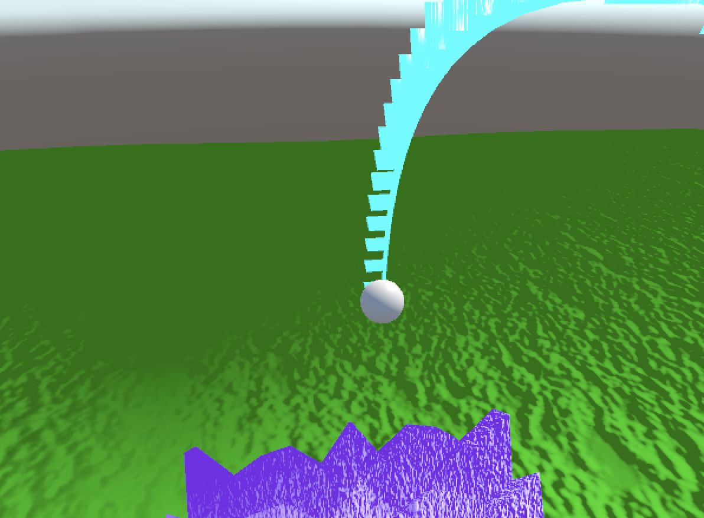

Unity 2022.3.36f

3D Unity Scene with algorithmically generated terrain and arch. 

Animation: The arch continually grows and shrinks above the terrain, while the terrain
moves in a wave-like pattern

Interactions: The terrain can be moved around by the user, and the arch can be rotated.

Lighting: All lighting effects are calculated manually in shaders, without using any
built in lighting effects in Unity. 

Texture: Bump mapping was used to generate unique textures for the arch, terrain, and
surrounding terrain.

Camera: Users can toggle between first person camera controls, or an orbiting camera 
control

Instructions: Open project file in Unity Hub. When running the scene, press 'h' for a
list of controls.

